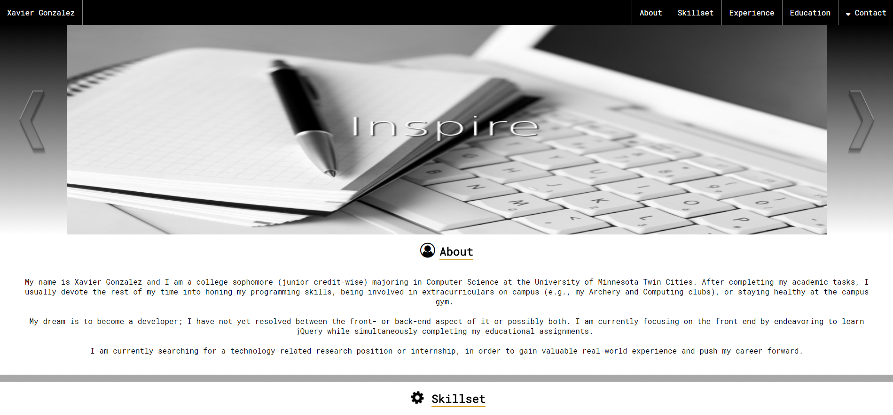
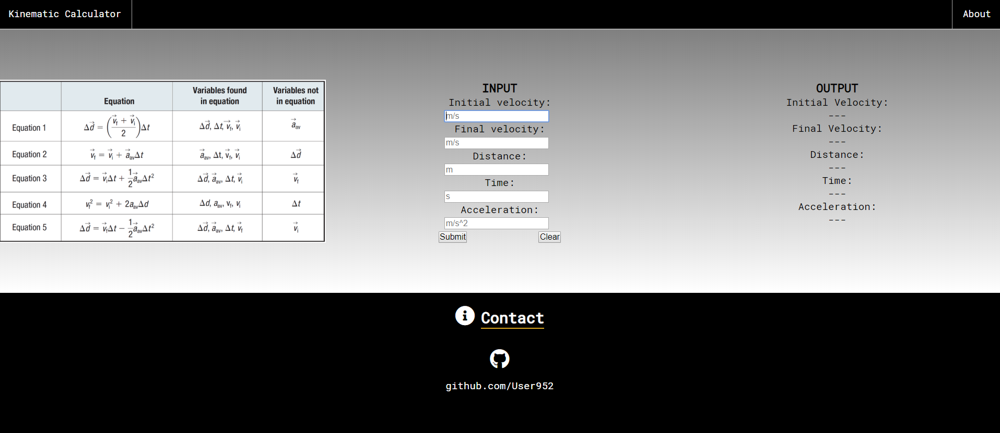

# User952.github.io
An online portfolio of my projects.

# Personal Résumé Website

Located at https://user952.github.io/. I began this project with the intention of showcasing my HTML, CSS, and JavaScript skills;
nonetheless, I found it to have been a wonderful and valuable learning experience. By participating in hands-on learning about topics such 
as configuring the margin and padding of numerous elements on a page at once, creating a collapsible navigation bar, and implementing 
JavaScript with HTML and CSS, I feel much more prepared to work on other projects using these languages.

# Kinematic Equation Calculator

A project that computes the five values commonly utilized within kinematic equations in physics. By inputting only three or four of the five, the rest will be comptued by the JavaScript code I created.

# Pomodoro Timer

This project aims to create a timer that implements the famous Pomodoro Technique. With this tool, users will be able to better manage their time; ergo, leading to better allocations and results. This website is currently a work in progress.
