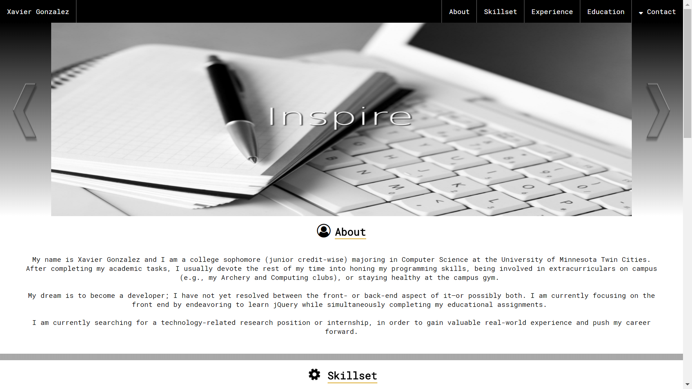

# User952.github.io
An online portfolio of my projects.

# Personal Résumé Website

Located at https://user952.github.io/. I began this project with the intention of showcasing my HTML, CSS, and JavaScript skills;
nonetheless, I found it to have been a wonderful and valuable learning experience. By participating in hands-on learning about topics such 
as configuring the margin and padding of numerous elements on a page at once, creating a collapsible navigation bar, and implementing 
JavaScript with HTML and CSS, I feel much more prepared to work on other projects using these languages.

# Kinematic Equation Calculator

A project to be started at a later date. It will consist of a site that could calculate all five kinematic values given only three of
them. While the Peronsal Résumé Website focused more heavily on the HTML and CSS files over the JavaScript code, the Kinematic Equation 
Calculator must prioritize the JavaScript functions in order to compute correct results.
